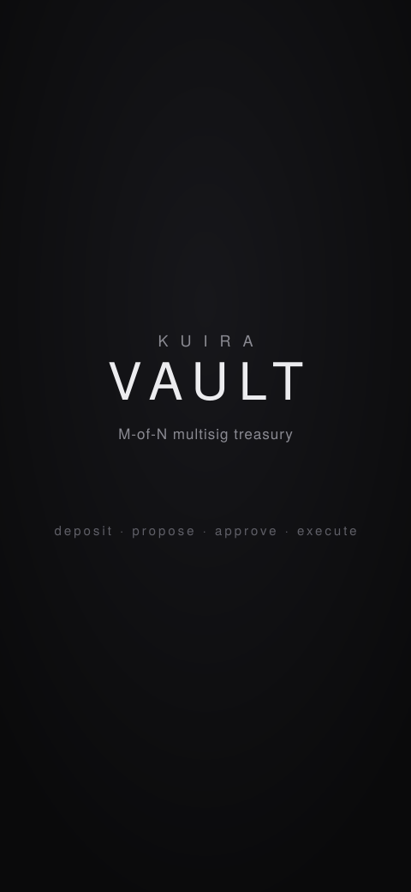

---
hide:
  - toc
---

# Examples

Working dApps built on the Kuira SDK — clone, build, and read the source. Each links to its repo, where a one-tap agent prompt gets it running on a device.

<a class="kuira-example" href="https://github.com/kuiralabs/kuira-starter-android">

Starter
Kuira Starter
A minimal counter dApp: Sigil identity, embedded wallet, and a 6-line Compact contract you deploy and increment on-chain. ~700 lines, also a GitHub template.
View on GitHub →

</a>
<a class="kuira-example" href="https://github.com/kuiralabs/example-bboard-android">

Example
BBoard
An on-chain bulletin board — the deploy, call, and read flow end-to-end: create a board, post and take down messages, or connect to one someone shared.
View on GitHub →

</a>
<a class="kuira-example" href="https://github.com/kuiralabs/midnight-kicks">

Example
Midnight Kicks
A ZK penalty shootout on Unity 3D and Kotlin, with a Compact contract as the on-chain referee. Commit-reveal so neither side can cheat, and every move is proved on the phone.
View on GitHub →

</a>
<a class="kuira-example" href="https://github.com/kuiralabs/kuira-vault-android">

Example
Kuira Vault
An M-of-N multisig treasury: deposit, propose, approve, execute. A threshold of independent passkey signers governs real fund movement, with chain-truth reads and multi-device Connect.
View on GitHub →

</a>

